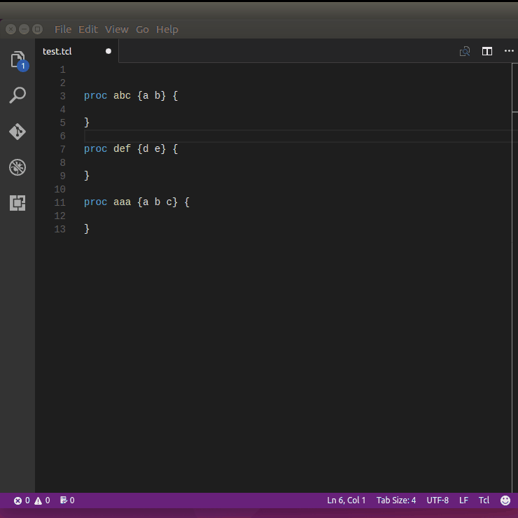

# tcl-outline (extension for VS Code)

This extension parses .tcl file in current active editor and show name of `proc` with their parameter list in an output window.

**Note:**
> Due to lack of time some other TCL language elements such as `namespace`, `global` global variables etc. are not included at the moment.
> 

## Features

* `ctrl+shift+p` or `F1` and enter `tcl outline` to select the commands

## Extension Settings

At the moment there is no settings available.

## Known Issues

## Source

* [Github](https://github.com/raycarter/tcl-outline-vscode)

## License

MIT

## Release Notes

### 0.1.1

* no need to install tcl language support first

### 0.1.0

* Only `proc` (functions) are indicated.

-----------------------------------------------------------------------------------------------------------

